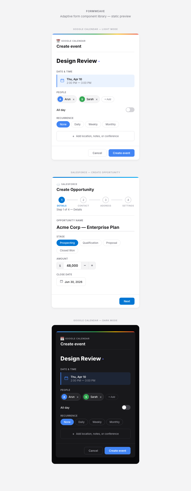

# FormWeave

**Beautiful, intelligent forms from JSON Schema -- for MCP tools, A2A agents, and human-in-the-loop AI.**

[](LICENSE)
[](packages/formweave/package.json)



Every AI agent that calls tools eventually needs a human to review, approve, or fill in parameters. Today, those forms are ugly -- raw JSON textareas, generic Bootstrap inputs, or bespoke UI that someone had to hand-build for each tool. FormWeave fixes this permanently. Pass any JSON Schema to a single `<Form>` component and get a production-quality, accessible, beautifully styled form with zero configuration. One line of code. Every MCP tool. Every A2A handoff. Every CopilotKit action.

```tsx
<Form schema={tool.inputSchema} onSubmit={(data) => execute(data)} />
```

That is the entire API for 90% of use cases.

---

## Why FormWeave Exists

MCP (Model Context Protocol) has crossed 100M+ monthly SDK downloads. Every MCP tool invocation can require human approval -- a user needs to review the agent's proposed arguments, edit them, and confirm before execution. The A2A (Agent-to-Agent) protocol introduces structured handoffs between agents, where approval forms sit at the boundary. CopilotKit's `renderAndWait` pattern demands custom UI for every single tool action. The surface area is enormous and growing fast.

The current state of affairs is painful. Developers either dump raw JSON into a textarea, reach for react-jsonschema-form (RJSF) and get a clunky, 45KB form that re-renders on every keystroke, or hand-build custom forms for each tool -- which does not scale when your agent has access to 50 MCP servers with 500+ tools. Nobody wants to write a thousand form components.

FormWeave is **Stripe Elements for agent forms**. You pass a JSON Schema -- the same `inputSchema` that every MCP tool already exposes -- and FormWeave analyzes it once, resolves the optimal widget for every field, groups related fields intelligently, hides optional fields behind progressive disclosure, auto-detects your design system, and renders a form that looks like your team designed it. The analysis takes under 1ms. The form renders in a single pass. There is no per-keystroke overhead.

---

## Quick Start

```bash
npm install formweave
```

```tsx
import { Form } from 'formweave';
import 'formweave/styles.css';

const createEventSchema = {
  type: 'object',
  required: ['summary'],
  properties: {
    summary:    { type: 'string' },
    start_time: { type: 'string', format: 'date-time' },
    end_time:   { type: 'string', format: 'date-time' },
    location:   { type: 'string' },
    all_day:    { type: 'boolean' },
  },
};

function App() {
  return (
    <Form
      schema={createEventSchema}
      onSubmit={(data) => console.log('Submitted:', data)}
    />
  );
}
```

FormWeave automatically turns `summary` into a large borderless title input, pairs `start_time` and `end_time` into a visual datetime block, renders `all_day` as a toggle switch, and hides the optional `location` field behind a "1 more field" disclosure. No configuration required.

---

## The Agentic Use Cases

FormWeave was built for the agentic stack. Here are six real-world scenarios with complete, copy-pasteable code.

### 1. MCP Tool Approval (Human-in-the-Loop)

An agent wants to create a Jira ticket. Your MCP client intercepts the tool call and shows a FormWeave form so the user can review the agent's proposed values, edit them, and approve or deny.

```tsx
import { Form } from 'formweave';
import 'formweave/styles.css';

function ToolApprovalDialog({ tool, mcpClient }) {
  return (
    <Form
      schema={tool.inputSchema}
      values={tool.args}
      mode="approval"
      server={{ name: tool.serverName }}
      onSubmit={(data) => mcpClient.approveTool(tool.id, data)}
      onCancel={() => mcpClient.rejectTool(tool.id)}
    />
  );
}
```

The `mode="approval"` prop changes the submit button to "Approve", adds a "Deny" action, and visually marks agent-prefilled values with a subtle AI indicator dot. The `server` prop triggers brand resolution -- if the server is "Jira", FormWeave automatically applies the Jira icon and brand color to the form header.

### 2. AG-UI / CopilotKit renderAndWait

Using the `@formweave/ag-ui` adapter inside CopilotKit's action handler. The `AgentForm` component maps CopilotKit's lifecycle states (`awaiting`, `executing`, `complete`, `error`) onto the base Form's mode and action buttons automatically.

```tsx
import { AgentForm } from '@formweave/ag-ui';
import { useCopilotAction } from '@copilotkit/react-core';

const toolSchema = {
  type: 'object',
  required: ['summary'],
  properties: {
    summary:    { type: 'string' },
    start_time: { type: 'string', format: 'date-time' },
    end_time:   { type: 'string', format: 'date-time' },
    attendees:  { type: 'array', items: { type: 'string', format: 'email' } },
    location:   { type: 'string' },
  },
};

useCopilotAction({
  name: "create_event",
  render: ({ args, status, handler }) => (
    <AgentForm
      schema={toolSchema}
      values={args}
      status={status}
      onApprove={(data) => handler.approve(data)}
      onReject={() => handler.reject()}
    />
  ),
});
```

When `status` is `"executing"`, the form dims and shows a spinner overlay. When `status` is `"complete"`, the form collapses to a checkmark. When `status` is `"error"`, a retry button appears. All of this is handled by `AgentForm` -- you write zero state management code.

### 3. A2A Agent Handoff

When Agent A hands structured data to Agent B and needs human confirmation at the boundary. The form displays the handoff payload for review before the receiving agent processes it.

```tsx
import { Form } from 'formweave';
import 'formweave/styles.css';

function AgentHandoffReview({ handoff, onConfirm, onReject }) {
  return (
    <Form
      schema={handoff.payloadSchema}
      values={handoff.payload}
      mode="approval"
      heading={`${handoff.fromAgent} wants to pass data to ${handoff.toAgent}`}
      server={{ name: handoff.fromAgent }}
      onSubmit={(data) => onConfirm({ ...handoff, payload: data })}
      onCancel={() => onReject(handoff.id)}
    />
  );
}
```

### 4. Multi-Tool Batch Approval

The agent proposes three actions at once. Show stacked accordion forms with individual approve/deny per tool.

```tsx
import { Form } from 'formweave';
import 'formweave/styles.css';

function BatchApproval({ pendingTools, approve, reject }) {
  return (
    <div>
      {pendingTools.map((tool, i) => (
        <Form
          key={tool.id}
          schema={tool.inputSchema}
          values={tool.args}
          display="accordion"
          accordionTitle={`${tool.serverName}: ${tool.name}`}
          accordionDefaultOpen={i === 0}
          server={{ name: tool.serverName }}
          mode="approval"
          onSubmit={(data) => approve(tool.id, data)}
          onCancel={() => reject(tool.id)}
        />
      ))}
    </div>
  );
}
```

Each accordion section gets the correct brand icon and color. The first tool opens by default; the rest are collapsed. Users can expand, review, edit, and approve each one individually.

### 5. Chat-Embedded Forms

A form appears inline in a chat thread -- a Slack bot, Teams bot, or web chat UI. The `inline` display mode strips the card chrome and renders the form flush with the surrounding content.

```tsx
import { Form } from 'formweave';
import 'formweave/styles.css';

function ChatMessage({ agentRequest, resumeAgent }) {
  return (
    <div className="chat-message chat-message--agent">
      <p>I need a few details to proceed:</p>
      <Form
        schema={agentRequest}
        display="inline"
        onSubmit={(data) => resumeAgent(data)}
      />
    </div>
  );
}
```

### 6. Cross-Server Tool Intelligence

FormWeave can auto-discover MCP tools across all connected servers and use them to upgrade form fields. Pass the full tool list and FormWeave's 3-tier matching engine (exact match, schema-based, Jaro-Winkler fuzzy) connects fields to relevant tools.

```tsx
import { Form } from 'formweave';
import 'formweave/styles.css';

function SmartToolForm({ tool, mcpClient }) {
  return (
    <Form
      schema={tool.inputSchema}
      tools={mcpClient.listTools()}
      onToolCall={(name, args) => mcpClient.callTool(name, args)}
      onSubmit={(data) => mcpClient.executeTool(tool.name, data)}
    />
  );
}
// Result: "attendees" field becomes a people picker searching Google Contacts + Slack users
// "channel" field becomes a dropdown populated from the Slack list_channels tool
// "location" field gets autocomplete from Google Places
```

---

## How It Works

FormWeave uses a 5-stage pipeline that runs once per schema, not once per render.

**1. Schema Analysis (<0.1ms)** -- Parse the JSON Schema, build a flat field map, detect conditionals (`if`/`then`/`else`), and infer an action label from the schema title or tool name.

**2. Widget Resolution (<0.1ms)** -- Apply 50+ deterministic rules to map each field to its optimal widget. Rules consider field name, type, format, constraints, enum values, and cross-field relationships. A `required string named "summary"` becomes a `title-input`. A `boolean` becomes a `toggle`. An `array of emails` becomes a `people-picker`. Two datetime fields named `start_*` and `end_*` merge into a paired `datetime-block`.

**3. Layout Computation (<0.1ms)** -- Assign fields to tiers (essential, details, advanced) based on whether they are required, have defaults, or match optional-field name patterns. Detect semantic groups (datetime pairs, address clusters, contact clusters). If the field count exceeds the wizard threshold (default 15), split into multi-step wizard pages.

**4. Skeleton Render (<0.5ms)** -- Render the form layout immediately with placeholder widgets. The user sees a fully laid-out form structure before heavy widgets (code editor, rich text) finish loading.

**5. Hydrate and Enhance (<16ms)** -- Swap in real widget implementations. Heavy widgets are lazy-loaded. Tool-enhanced fields initiate their first data fetch. Everything completes within a single animation frame.

Total time from schema to interactive form: under 16ms for typical schemas. RJSF pays a comparable cost on every keystroke.

---

## The Design Rules

FormWeave includes 50+ deterministic rules that map schema shapes to the right widget. These are what make the forms beautiful without configuration. Here are the most impactful ones:

| Schema Pattern | Widget | What the User Sees |
|---|---|---|
| `required` + name matches `title/summary/name/subject` | `title-input` | Large 28px borderless inline text, not a labeled input |
| `type: boolean` | `toggle` | iOS-style toggle switch, never a checkbox |
| `type: string` + `enum` with <=5 values | `pill-selector` | Horizontal pill buttons, not a dropdown |
| `type: string` + `enum` with >5 values | `dropdown-select` | Searchable dropdown with type-ahead |
| `type: string` + `enum` values are all hex colors | `color-dots` | Visual color dot palette |
| `type: string` + `format: date-time` | `datetime-block` | Visual calendar/time block |
| Paired `start_time`/`end_time` with `format: date-time` | `datetime-block` (grouped) | Single visual event-style date range block |
| `type: string` + name matches `description/notes/body/...` | `textarea` | Multi-line text with auto-resize |
| `type: string` + `maxLength > 200` | `textarea` | Multi-line text, inferred from constraint |
| `type: string` + `description.length > 80` | `textarea` | Multi-line text, inferred from verbose description |
| `type: string` + `format: data-url` | `file-upload` | Drag-and-drop file upload zone |
| `type: array` + `items.format: email` | `people-picker` | Avatar-based people picker with search |
| `type: array` + `items.type: string` (no format) | `tag-input` | Tokenized tag input with keyboard support |
| `type: array` + `items.type: object` (>3 props) | `array-table` | Editable table with columns |
| `type: array` + `items.type: object` (<=3 props) | `array-list` | Stackable card list |
| `type: number` or `type: integer` | `number-stepper` | Input with +/- stepper buttons and min/max |
| `type: object` with properties | `object-section` | Collapsible nested section |
| Fields named `street/city/state/zip/country` | Grouped | Address cluster rendered as a visual group |
| >15 fields total | Wizard | Automatic multi-step wizard with progress indicator |
| Required fields with no default | Tier: essential | Shown immediately |
| Optional fields | Tier: details/advanced | Hidden behind progressive disclosure |

---

## Design System Detection

FormWeave auto-detects your host design system by probing the DOM for signature CSS custom properties. When it finds a match, it adapts its styling to blend in seamlessly.

| Design System | CSS Variables Probed | Adaptation |
|---|---|---|
| **shadcn/ui** | `--radius`, `--primary`, `--foreground`, `--background`, `--border`, `--muted`, `--card`, `--accent` | Matches border radius, color palette, and typography |
| **Material UI** | `--mui-palette-primary-main`, `--mui-shape-borderRadius`, `--mui-typography-fontFamily` | Adapts to Material Design tokens |
| **Ant Design** | `--ant-color-primary`, `--ant-border-radius`, `--ant-font-family` | Matches Ant color and spacing system |
| **Chakra UI** | `--chakra-colors-primary`, `--chakra-radii-md`, `--chakra-fonts-body` | Adapts to Chakra design tokens |
| **Tailwind v4** | `--color-primary`, `--spacing`, `--font-sans`, `--radius-lg` | Uses Tailwind v4 CSS theme variables |

Detection requires at least 2 matching variables with a confidence threshold. If no system is detected, FormWeave uses its own default theme (indigo primary, 8px radius, system font stack).

You can also set the theme explicitly:

```tsx
<Form schema={schema} theme="shadcn" />
<Form schema={schema} theme="material" />
<Form schema={schema} theme={{ primary: '#059669', radius: 12, fontFamily: 'Inter', density: 'compact' }} />
```

---

## Brand Resolution

When you pass a `server` prop, FormWeave resolves branding through a 4-tier cascade:

**Tier 1: Explicit** -- If you provide `icon` and `color` on the server config, those are used directly.

**Tier 2: Favicon** -- If you provide a `serverUrl`, FormWeave extracts the domain and fetches the favicon. Only public HTTP/HTTPS URLs are resolved to prevent leaking internal hostnames.

**Tier 3: Registry** -- FormWeave includes a built-in registry of 40 popular services with pre-configured icons and brand colors:

> Google Calendar, Gmail, Slack, GitHub, GitLab, Jira, Confluence, Notion, Linear, Asana, Trello, Salesforce, HubSpot, Zendesk, Stripe, Twilio, SendGrid, AWS, Discord, Teams, Zoom, Figma, Dropbox, Box, Airtable, Monday, ClickUp, Intercom, Segment, Datadog, PagerDuty, Opsgenie, Vercel, Netlify, Cloudflare, Supabase, Firebase, Sentry, LaunchDarkly, Amplitude

**Tier 4: Generated** -- For unrecognized services, FormWeave generates a deterministic brand using a hash-to-hue algorithm: the service name is hashed to produce a consistent HSL color, and the first letter is used as the icon. The same service always gets the same color.

```tsx
<Form schema={schema} server={{ name: 'Jira' }} />
// Automatically gets the Jira icon and #0052CC brand color

<Form schema={schema} server={{ name: 'My Internal Tool', serverUrl: 'https://internal.example.com' }} />
// Fetches favicon from the URL, generates a deterministic color from the name
```

---

## Display Modes

| Mode | Prop Value | Description | Best For |
|---|---|---|---|
| **Card** | `display="card"` | Elevated card with header, shadow, and rounded corners | Standalone forms, dialogs |
| **Inline** | `display="inline"` | No chrome, renders flush with surrounding content | Chat-embedded, inline flows |
| **Accordion** | `display="accordion"` | Collapsible section with title bar | Batch approval, stacked forms |
| **Panel** | `display="panel"` | Side panel or drawer layout with header | Sidebars, detail panels |
| **Wizard** | `display="wizard"` | Multi-step with progress navigation | Complex forms with 15+ fields |

Each display mode composes with the three form modes (`edit`, `approval`, `readonly`) and two density settings (`comfortable`, `compact`).

---

## API Reference

### `<Form>` Props

| Prop | Type | Default | Description |
|---|---|---|---|
| `schema` | `JSONSchema7` | *required* | The JSON Schema describing the form fields |
| `values` | `Record<string, any>` | `{}` | Initial/pre-filled values (e.g., agent-proposed arguments) |
| `tools` | `MCPTool[]` | `undefined` | Available MCP tools for cross-server field enhancement |
| `onSubmit` | `(data) => void` | `undefined` | Called with validated form data on submission |
| `onChange` | `(data, changedField) => void` | `undefined` | Called on every field change with full form state |
| `onToolCall` | `(toolName, args) => Promise<any>` | `undefined` | Handler for tool-enhanced field data fetching |
| `server` | `ServerConfig` | `undefined` | Server/service branding (`{ name, icon?, serverUrl?, color? }`) |
| `heading` | `string` | Schema title | Custom form heading |
| `description` | `string` | `undefined` | Descriptive text shown below the heading |
| `iconUrl` | `string` | `undefined` | Custom icon URL for the form header |
| `theme` | `ThemePreset \| ThemeConfig` | `'auto'` | `'auto'`, `'default'`, `'shadcn'`, `'material'`, `'minimal'`, or a custom config object |
| `density` | `'compact' \| 'comfortable'` | `'comfortable'` | Controls spacing and sizing of form elements |
| `display` | `DisplayMode` | `'card'` | `'card'`, `'inline'`, `'accordion'`, `'panel'`, or `'wizard'` |
| `mode` | `FormMode` | `'edit'` | `'edit'`, `'approval'`, or `'readonly'` |
| `submitLabel` | `string` | `'Submit'` / `'Approve'` | Custom label for the submit button |
| `onCancel` | `() => void` | `undefined` | Cancel/deny handler; shows a cancel button when provided |
| `actions` | `ActionConfig[]` | `undefined` | Custom action buttons (`{ label, variant, onClick, position }`) |
| `accordionTitle` | `string` | Heading or schema title | Title for the accordion header when `display="accordion"` |
| `accordionDefaultOpen` | `boolean` | `true` | Whether the accordion starts expanded |
| `wizardThreshold` | `number` | `15` | Field count that triggers automatic wizard mode |
| `wizardSteps` | `string[]` | Auto-generated | Custom wizard step labels |
| `defaults` | `Record<string, any>` | `undefined` | Default values (lower priority than `values`) |
| `showDiff` | `boolean` | `false` | Highlight differences between `defaults` and `values` |
| `toolCacheTTL` | `number` | `undefined` | Cache duration in ms for tool-enhanced field results |
| `toolTimeout` | `number` | `undefined` | Timeout in ms for tool calls |
| `toolPolicy` | `{ allowed?, denied? }` | `undefined` | Allowlist/denylist for which tools can be called |
| `locale` | `string` | `undefined` | Locale for label humanization |
| `labels` | `Record<string, string>` | `undefined` | Custom labels keyed by field path |
| `className` | `string` | `undefined` | Additional CSS class on the root form element |
| `style` | `Record<string, string \| number>` | `undefined` | Inline styles on the root form element |

### `<AgentForm>` Props (`@formweave/ag-ui`)

Extends all `<Form>` props (except `onSubmit`, `onCancel`, `mode`) and adds:

| Prop | Type | Default | Description |
|---|---|---|---|
| `status` | `'awaiting' \| 'executing' \| 'complete' \| 'error'` | `'awaiting'` | Current agent interaction lifecycle state |
| `onApprove` | `(data) => void` | `undefined` | Called when the user approves the form data |
| `onReject` | `() => void` | `undefined` | Called when the user rejects/cancels |
| `errorMessage` | `string` | `undefined` | Error message displayed when `status` is `'error'` |

---

## Packages

| Package | Description | Size |
|---|---|---|
| `formweave` | Main entry point -- `import { Form } from 'formweave'` | ~28 KB gzip total |
| `@formweave/core` | Schema inference engine, widget resolver, tool matcher (framework-agnostic, zero dependencies) | ~7.5 KB |
| `@formweave/react` | React `<Form>` component, Zustand store, validation, brand resolution | ~7.7 KB |
| `@formweave/widgets` | 21 accessible React widget components (text, toggle, pill-selector, datetime-block, people-picker, ...) | ~11.6 KB |
| `@formweave/theme` | CSS, design tokens, theme presets, design system auto-detection | ~2.2 KB + 8.7 KB CSS |
| `@formweave/ag-ui` | CopilotKit / AG-UI protocol adapter (`<AgentForm>`) | ~1 KB |

All packages are ESM and CJS dual-published, fully tree-shakeable, and ship TypeScript declarations.

---

## Performance

FormWeave's core analysis engine was benchmarked across 1,000 iterations per schema with median timing. These numbers are from the project's competitive benchmark suite.

| Schema | Fields | Analysis Time (median) | Widget Resolution | Group Detection |
|---|---|---|---|---|
| Google Calendar `create_event` | 5 | <0.5ms | <0.1ms | <0.1ms |
| Slack `send_message` | 15 | <1ms | <0.1ms | <0.1ms |
| Salesforce `create_opportunity` | 30 | <1ms | <0.1ms | <0.1ms |
| Jira `create_issue` (with conditionals) | 20 | <1ms | <0.1ms | <0.1ms |
| Stress test (mixed types) | 100 | <10ms | <3ms | <2ms |
| Extreme stress test | 500 | <50ms | <10ms | <5ms |

**Why this matters vs. alternatives:** RJSF, JSON Forms, and Formily do not pre-analyze schemas. They process the schema on every render cycle, which means their "analysis" cost is paid repeatedly -- on every keystroke, for every field. A 30-field RJSF form triggers approximately 30 component re-renders per keystroke. FormWeave analyzes once and stores the result in a Zustand store with per-field subscriptions, so only the changed field re-renders.

---

## Comparison with Alternatives

| Feature | FormWeave | RJSF | JSON Forms | Formily |
|---|---|---|---|---|
| **MCP-aware (tool integration)** | Yes | No | No | No |
| **A2A / AG-UI adapter** | Yes | No | No | No |
| **Schema pre-analysis (one-time)** | Yes | No (per render) | No (per render) | No (per render) |
| **50+ widget resolution rules** | Yes | Basic | Basic | Basic |
| **Progressive disclosure** | Yes | No | No | No |
| **Automatic field grouping** | Yes | No | No | No |
| **Datetime pair detection** | Yes | No | No | No |
| **Address/contact clustering** | Yes | No | No | No |
| **Wizard auto-generation** | Yes | No | No | No |
| **Design system auto-detection** | Yes | No | Partial | No |
| **Brand/server resolution** | Yes (40 services) | No | No | No |
| **AI-prefilled field indicators** | Yes | No | No | No |
| **Reward-early-punish-late validation** | Yes | No | No | No |
| **Per-field store (no full re-render)** | Yes (Zustand) | No | No | Partial |
| **Conditional fields (if/then/else)** | Yes | Yes | Yes | Yes |
| **Bundle size (core)** | ~8 KB | ~45 KB | ~35 KB | ~50 KB |
| **Zero runtime deps (core)** | Yes | No | No | No |

---

## Security

FormWeave includes hardening against common attack vectors in schema-driven form rendering:

- **Prototype pollution guards** -- Keys like `__proto__`, `constructor`, and `prototype` are filtered from all value-merging paths (initial values, defaults, form data).
- **Schema depth limits** -- Prevents stack overflow from deeply nested or recursive schemas.
- **Input sanitization** -- All user-provided values are sanitized before rendering to prevent XSS through field descriptions or enum labels.
- **CSS injection prevention** -- Brand colors and custom theme values are validated before being applied as CSS custom properties.
- **Favicon URL restriction** -- Only public HTTP/HTTPS URLs are resolved for favicons to prevent leaking internal hostnames.
- **ReDoS protection** -- All regex patterns used in widget resolution are constant-time and do not accept user-provided input.

---

## Contributing

```bash
git clone https://github.com/ArunKBhaskar/FormWeave.git
cd FormWeave
pnpm install
pnpm turbo build
pnpm turbo test
```

The test suite includes 149 tests across unit tests, benchmark tests, and competitive benchmark tests covering schema analysis, widget resolution, tool matching, grouping, progressive disclosure, conditionals, wizard computation, and label humanization.

**Project structure:**

```
packages/
  core/       Schema inference engine (framework-agnostic)
  react/      React Form component + Zustand store + validation
  widgets/    21 widget components
  theme/      CSS + design tokens + theme detection
  ag-ui/      CopilotKit / AG-UI adapter
  formweave/  Main entry point (re-exports all packages)
```

---

## License

MIT
